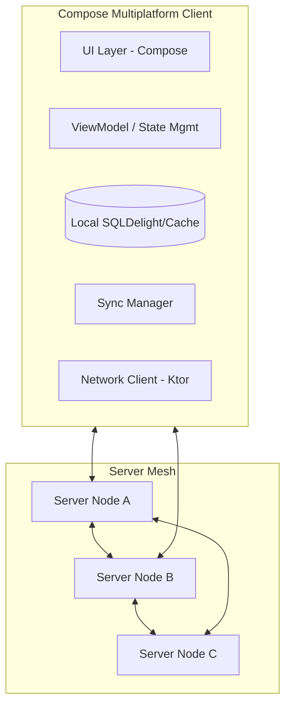

# Architecture Layout: Multiplatform Password Manager

Since you are writing the program yourself, here is the structural breakdown of the necessary components for both the Client and Server.

## 1. High-Level Architecture
The system follows a **Mesh-Network Shared Vault** pattern.

---

## 2. Server-Side Components (Java/Kotlin - e.g., Ktor/Spring Boot)

| Component | Responsibility |
| :--- | :--- |
| **Auth Module** | Handles User Login and Session Tokens. Provides the "Admin Recovery Token" logic. |
| **Data API (REST/gRPC)** | CRUD operations for the Key-Value pairs. |
| **Mesh Sync Service** | Communicates with other servers. Broadcasts updates and polls for missing sequence IDs. |
| **Discovery Service** | Returns a list of "Known Peers" (other server IPs/URLs) to the requester. |
| **Persistence Layer** | Stores data in SQLite (portable) or JSON files (for easy manual recovery). |
| **CLI / Recovery Tool** | A small utility to dump the database if the user has local server access. |

---

## 3. Client-Side Components (Compose Multiplatform)

| Component | Responsibility |
| :--- | :--- |
| **Network Layer** | Handles communication with the server cluster. Implements "Next-on-Failure" logic to try S2 if S1 is down. |
| **Local Vault (Cache)** | Keeps a copy of the passwords for offline use. |
| **Sync Manager** | Reconciles local changes with server updates using `version` numbers or timestamps. |
| **Service Discoverer** | Periodically updates the "Servers List" based on peer info received from the connected server. |
| **UI: Password List** | Modern list with search, categorization, and "One-tap Copy". |
| **UI: Entry Editor** | Fields for Name, Password, URL, and Description. |

---

## 4. Communication Flow (Sync & Discovery)

1.  **Client -> Server A**: "Give me my data + tell me who your friends (other servers) are."
2.  **Server A -> Client**: Sends data payload + List of `[Server B, Server C]`.
3.  **Client**: Updates local server list for future redundancy.
4.  **Client -> Server A**: "I added a new password."
5.  **Server A -> Server B/C**: Broadcasts the new record instantly.

## 5. Technology Recommendations (Java Ecosystem)

*   **Language**: Kotlin (allows code sharing between Client and Server).
*   **Client Framework**: Compose Multiplatform (Desktop/Android/iOS/Web).
*   **Networking**: Ktor Client.
*   **Local Storage**: SQLDelight (cross-platform SQLite).
*   **Server Framework**: Ktor or Micronaut (lightweight over vanilla Java/Spring).
*   **Persistence**: SQLite or Flat JSON files for that "easy recovery" requirement.
